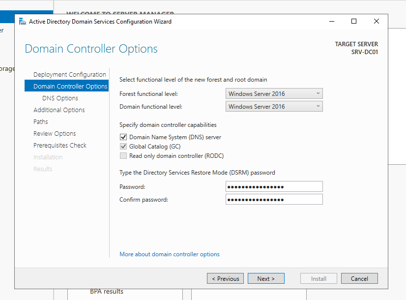
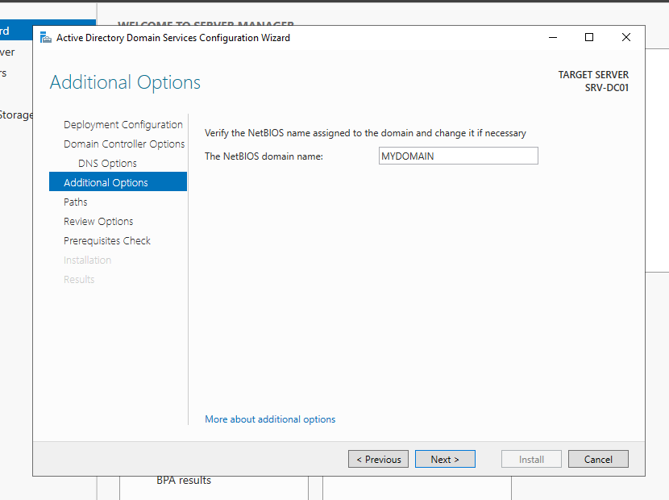
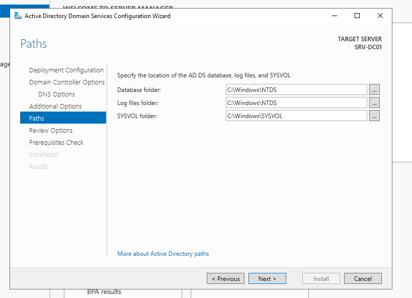
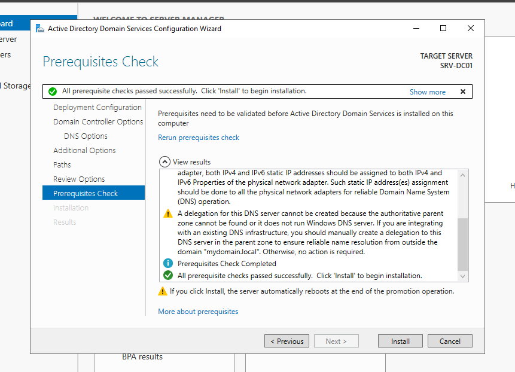
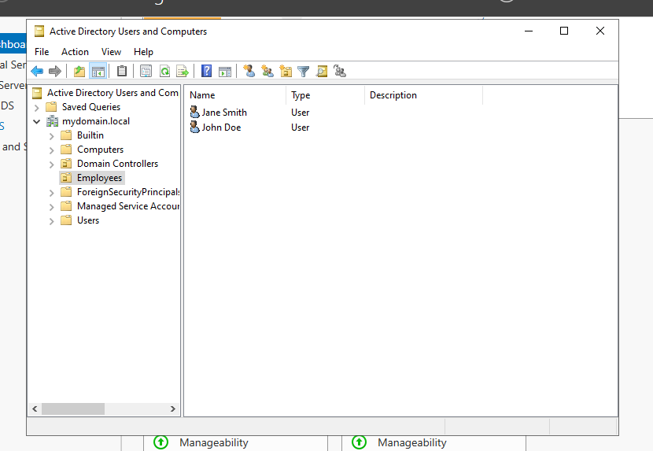
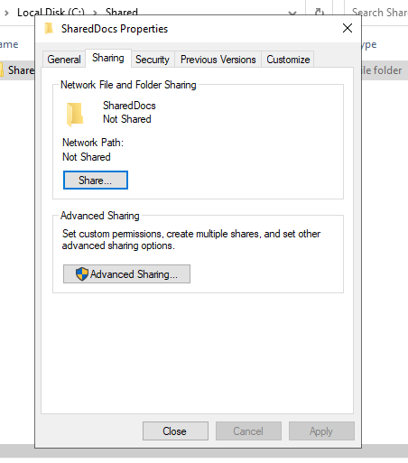
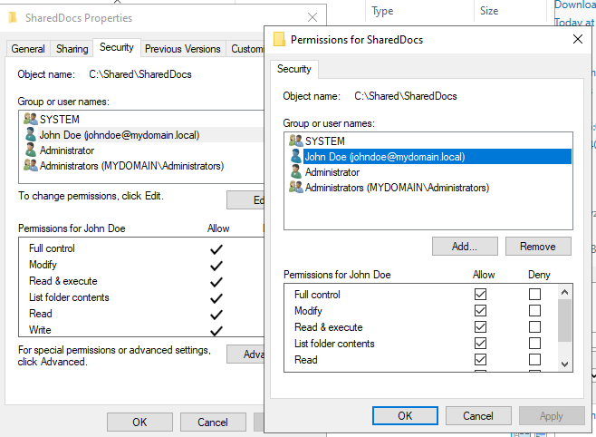
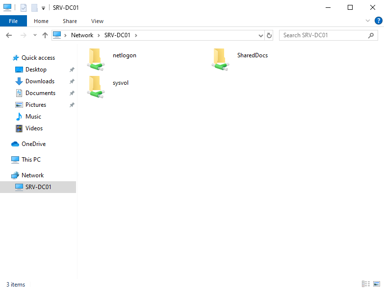
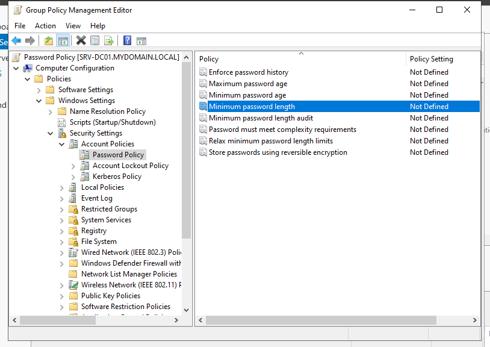
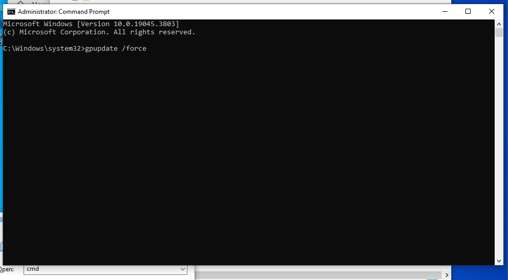

# Active Directory Setup Guide

This guide walks you through setting up **Active Directory (AD)** on **Windows Server 2022**, including promoting the server to a domain controller, creating users, and joining a Windows 10 VM to the domain.

## Prerequisites
- Windows Server VM configured (see WindowsServer-VM.md)
- Static IP address configured
- Windows Server updated
- Domain name planned (e.g., mydomain.local)

## Step 1: Install Active Directory Domain Services (AD DS)

1. Open Server Manager (launches automatically after login)
2. Click `Add roles and features`
3. In the Add Roles and Features Wizard:
   - Click `Next` until you reach Server Roles
   - Select `Active Directory Domain Services`
   - Click `Add Features` when prompted
   - Click `Next`
   - Complete the wizard and click `Install`


## Step 2: Promote the Server to a Domain Controller

1. After AD DS installation completes:
   - Click the Notification flag in Server Manager
   - Select `Promote this server to a domain controller`


2. Deployment Configuration:
   - Select `Add a new forest`
   - Enter root domain name (e.g., `mydomain.local`)


3. Domain Controller Options:
   - Set Forest and Domain Functional Levels to `Windows Server 2016`
   - Enter DSRM password (e.g., `P@ssw0rd123`)
   - Note: Use a strong password in production



4. Additional Configuration:
   - Click `Next` at DNS delegation warnings
   - Verify NetBIOS domain name (e.g., `MYDOMAIN`)



5. Paths Configuration:
   - Leave default paths for:
     - AD database
     - Log files
     - SYSVOL



6. Prerequisites Check:
   - Review for any errors/warnings
   - Click `Install` to begin promotion




7. Wait for installation and automatic restart

## Step 3: Verify Active Directory Installation

1. After restart, log in as Administrator
2. Open Server Manager
3. Verify AD DS is installed and running
4. Open Active Directory Users and Computers:
   - Go to `Tools` → `Active Directory Users and Computers`
   - Verify domain is listed


> Screenshot: Active Directory Users and Computers showing the domain

## Step 4: Create Test Users in Active Directory

1. Create Organizational Unit:
   - Right-click domain → `New` → `Organizational Unit`
   - Name: `Employees`

2. Create Test Users:
   ```
   User 1:
   - Username: john.doe
   - Password: P@ssw0rd123
   
   User 2:
   - Username: jane.smith
   - Password: P@ssw0rd123
   ```



## Step 5: Join Windows 10 VM to Domain

1. On Windows 10 VM:
   - Go to `Settings` → `System` → `About`
   - Click `Rename this PC (advanced)`
   - Click `Change` in System Properties

2. Join Domain:
   - Select `Domain`
   - Enter domain name (e.g., `mydomain.local`)
   - Click `OK`

3. Enter Domain Admin Credentials:
   ```
   Username: Administrator
   Password: [your domain admin password]
   Domain: mydomain.local
   ```
4. Restart when prompted

## Step 6: Verify Domain Join

1. Log in with domain user (e.g., `john.doe`)
2. Open Command Prompt and run:
   ```cmd
   systeminfo | findstr /B /C:"Domain"
   ```


## Step 7: Configure DNS Settings

### 7.1 Configure DNS on Domain Controller

1. Identify Domain Controller's IP:
   - Open Command Prompt
   - Run:
     ```cmd
     ipconfig /all
     ```
   - Note the IPv4 Address (e.g., 192.168.1.10)

2. Configure Domain Controller's DNS:
   - Open Network and Sharing Center
   - Click active network adapter
   - Click `Properties`
   - Select `Internet Protocol Version 4 (TCP/IPv4)`
   - Click `Properties`
   - Set Preferred DNS server to its own IP (e.g., 192.168.1.10)
   - Set Alternate DNS server to: 8.8.8.8 (optional)
   - Click `OK`

3. Verify DNS Configuration:
   - Open Command Prompt
   - Run:
     ```cmd
     ipconfig /all
     nslookup mydomain.local
     ```
   - Verify the DNS server matches the DC's IP

### 7.2 Configure DNS on Windows 10 VM

1. Configure Client DNS:
   - Open Network and Sharing Center
   - Click active network adapter
   - Click `Properties`
   - Select `Internet Protocol Version 4 (TCP/IPv4)`
   - Click `Properties`
   - Set Preferred DNS server to Domain Controller's IP (e.g., 192.168.1.10)
   - Set Alternate DNS server to: 8.8.8.8 (optional)
   - Click `OK`

2. Verify Client DNS Configuration:
   - Open Command Prompt
   - Run:
     ```cmd
     ipconfig /flushdns
     ipconfig /all
     nslookup mydomain.local
     ```
   - Verify DNS queries resolve through DC

### 7.3 Troubleshooting DNS

1. If DNS resolution fails:
   - Verify network connectivity:
     ```cmd
     ping <Domain Controller IP>
     ```
   - Flush DNS cache:
     ```cmd
     ipconfig /flushdns
     ```
   - Register DNS:
     ```cmd
     ipconfig /registerdns
     ```
   - Restart DNS Client service:
     ```cmd
     net stop dnscache
     net start dnscache
     ```

2. Common Issues:
   - Incorrect DNS server IP
   - Firewall blocking DNS (UDP/TCP 53)
   - Network connectivity issues
   - DNS service not running on DC

## Step 8: Configure File Sharing

### 8.1 Create a Shared Folder on Windows Server

1. Log in as Administrator
2. Create shared folder:
   - Open File Explorer
   - Navigate to desired location (e.g., `C:\Shared`)
   - Create new folder named `SharedDocs`

3. Configure sharing:
   - Right-click folder → `Properties`
   - Go to `Sharing` tab → Click `Share`
   - In Network Access window:
     - Add domain user (e.g., `john.doe`)
     - Set permission level to `Read/Write`
     - Click `Share` then `Done`




4. Configure NTFS permissions:
   - Go to `Security` tab → Click `Edit`
   - Add domain user
   - Assign `Read/Write` permissions
   - Click `OK`




### 8.2 Access Shared Folder from Windows 10 VM

1. Enable Network Discovery and File Sharing on Windows Server:
   - Open Control Panel
   - Go to `Network and Sharing Center`
   - Click `Change advanced sharing settings`
   - Expand `Domain` profile
   - Enable:
     - Network discovery
     - File and printer sharing
     - Turn off password protected sharing
   - Click `Save changes`

2. Enable Network Discovery on Windows 10 VM:
   - Open Control Panel
   - Go to `Network and Sharing Center`
   - Click `Change advanced sharing settings`
   - Expand `Domain` profile
   - Enable:
     - Network discovery
     - File and printer sharing
   - Click `Save changes`

3. Access Shared Folder:
   - Log in as domain user (e.g., `john.doe`)
   - Open File Explorer
   - Click `Network`
   - If you see "Network discovery is turned off":
     - Click `Enable network discovery and file sharing`
     - Click `Yes` when prompted
   - Double-click server (e.g., `SRV-DC01`)
   - Open `SharedDocs`

4. Test permissions by creating a new file




## Step 9: Configure and Test Group Policy

### 9.1 Create Group Policy Object (GPO)

1. On Windows Server:
   - Open Server Manager
   - Go to `Tools` → `Group Policy Management`

2. Create new GPO:
   - Expand domain
   - Right-click `Group Policy Objects` → `New`
   - Name: `Password Policy`
   - Click `OK`


3. Configure GPO:
   - Right-click new GPO → `Edit`
   - Navigate to:
     ```
     Computer Configuration →
     Policies →
     Windows Settings →
     Security Settings →
     Account Policies →
     Password Policy
     ```
   - Set `Minimum password length` to `8`
   - Click `OK`




### 9.2 Link GPO to Domain

1. In Group Policy Management Console:
   - Right-click domain
   - Select `Link an Existing GPO`
   - Choose `Password Policy`
   - Click `OK`


### 9.3 Apply and Verify GPO

1. On Windows 10 VM:
   - Log in as domain user
   - Open Command Prompt (Admin)
   - Run:
     ```cmd
     gpupdate /force
     ```



2. Restart Windows 10 VM

3. Verify GPO application:
   - Log in as domain user
   - Open Command Prompt
   - Run:
     ```cmd
     gpresult /r
     ```
   - Verify `Password Policy` appears under Applied GPOs


## Additional Resources

- [Active Directory Documentation](https://docs.microsoft.com/en-us/windows-server/identity/ad-ds/active-directory-domain-services)
- [Group Policy Documentation](https://docs.microsoft.com/en-us/windows-server/identity/ad-ds/get-started/group-policy-basics)
- [AD Best Practices](https://docs.microsoft.com/en-us/windows-server/identity/ad-ds/plan/security-best-practices/best-practices-for-securing-active-directory)
- [File Server Documentation](https://docs.microsoft.com/en-us/windows-server/storage/file-server/file-server-management)
- [Group Policy Best Practices](https://docs.microsoft.com/en-us/windows-server/identity/ad-ds/plan/security-best-practices/implementing-secure-administrative-hosts)
