# Home Lab Help Desk & Active Directory Project

## Overview

This project demonstrates the setup and configuration of a functional IT help desk environment within a home lab. It showcases the integration of core IT infrastructure components, including virtualization, Windows Server administration with Active Directory, and a ticketing system (osTicket).

The primary goals are:
*   To build a virtualized lab environment simulating a small business network.
*   To configure Active Directory Domain Services (AD DS) for centralized user management and authentication.
*   To deploy and customize the osTicket ticketing system for managing IT support requests.
*   To illustrate common IT support workflows, from ticket intake to resolution.

This repository serves as documentation for the setup process and can be used to quickly understand the project's architecture and the skills involved.

## Technologies Used

*   **Virtualization:** VMware Workstation Pro 17.x
*   **Operating Systems:**
    *   Windows Server 2022 (Domain Controller, IIS Host)
    *   Windows 10 Pro (Client Machine)
*   **Directory Service:** Active Directory Domain Services (AD DS)
*   **Web Server:** Internet Information Services (IIS) 10
*   **Scripting/Backend:** PHP 8.x (NTS)
*   **Database:** MySQL 8.x (with MySQL Workbench)
*   **Ticketing System:** osTicket v1.18.x

## Project Components

### 1. Lab Environment Setup (Virtualization)

The foundation of the lab is built using VMware Workstation Pro. This allows for the creation and management of isolated virtual machines for the server and client components.

*   **Setup:** Installation of VMware Workstation Pro and enabling hardware virtualization (VT-x/AMD-V).
    *   See: [`Lab-Setup/Virtualization.md`](Lab-Setup/Virtualization.md)
    *   
*   **Server VM:** A Windows Server 2022 VM (`SRV-DC01`) was created with appropriate resources (RAM, CPU, Disk) and configured with a static IP address. VMware Tools were installed for better integration.
    *   See: [`Lab-Setup/WindowsServer-VM.md`](Lab-Setup/WindowsServer-VM.md)
*   **Client VM:** A Windows 10 Pro VM was created, configured with NAT networking, and VMware Tools installed. This VM acts as the end-user machine for testing domain joining and accessing the ticketing system.
    *   See: [`Lab-Setup/Windows10-VM.md`](Lab-Setup/Windows10-VM.md)
    *   

### 2. Active Directory Domain Services (AD DS)

A core part of this project is the configuration of Active Directory on the Windows Server 2022 VM.

*   **Installation:** The AD DS role was installed via Server Manager.
    *   
*   **Domain Controller Promotion:** The server was promoted to a Domain Controller for a new forest (e.g., `mydomain.local`).
    *   
    *   
*   **User & OU Management:** Organizational Units (e.g., `Employees`) and test user accounts (e.g., `john.doe`, `jane.smith`) were created within Active Directory Users and Computers (ADUC).
    *   
    *   
*   **Client Domain Join:** The Windows 10 VM was successfully joined to the `mydomain.local` domain.
    *   
*   **DNS Configuration:** DNS settings were configured on both the Domain Controller and the client VM to ensure proper name resolution within the domain.
*   **File Sharing:** Basic file sharing was configured on the server, demonstrating NTFS and Share permissions for domain users.
    *   
    *   
*   **Details:** [`Lab-Setup/Active-Directory.md`](Lab-Setup/Active-Directory.md)

### 3. osTicket Help Desk System

osTicket was deployed on the Windows Server VM using IIS, PHP, and MySQL to provide a functional ticketing system.

*   **Prerequisites Installation (IIS, PHP, MySQL):**
    *   IIS was installed and configured with the CGI feature.
    *   PHP (Non-Thread Safe) was downloaded, configured (`php.ini`), and integrated with IIS via Handler Mappings.
    *   MySQL Server and Workbench were installed, and a dedicated database (`osticket`) and user (`osticketuser`) were created for osTicket.
    *   See: [`Ticketing-System/Installation.md`](Ticketing-System/Installation.md)
    *   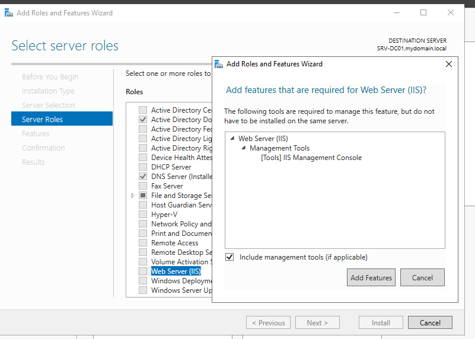
    *   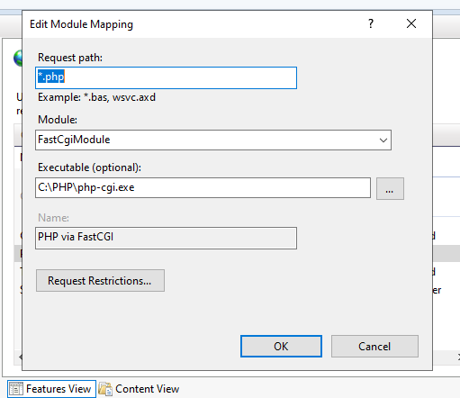
    *   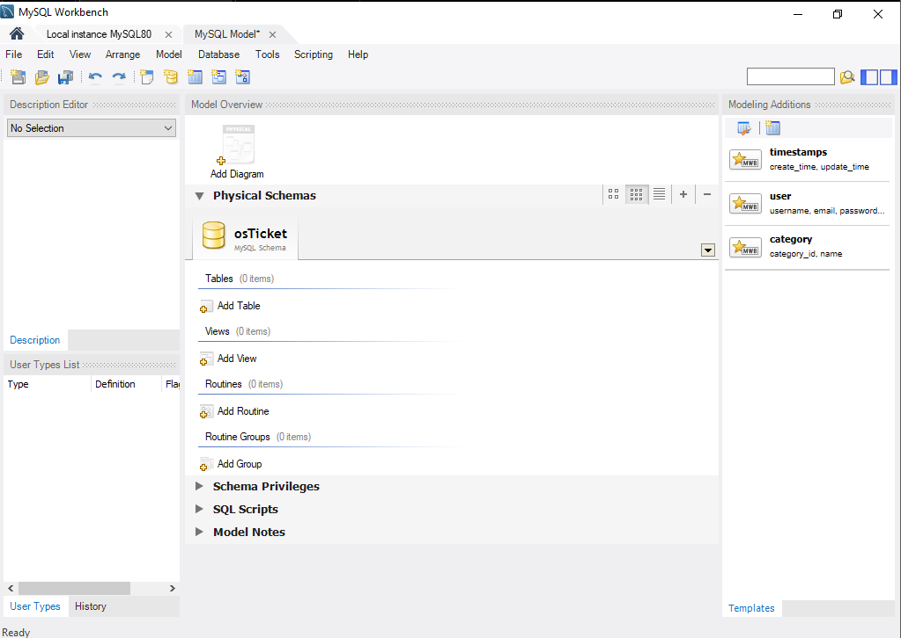
*   **osTicket Installation:** The osTicket application files were placed in the webroot (`C:\\inetpub\\wwwroot\\osTicket`), and the web-based setup was completed.
*   **osTicket Configuration:** The system was customized to simulate a professional help desk:
    *   **Departments:** Created distinct support departments (e.g., `IT Support`, `Network Operations`).
        *   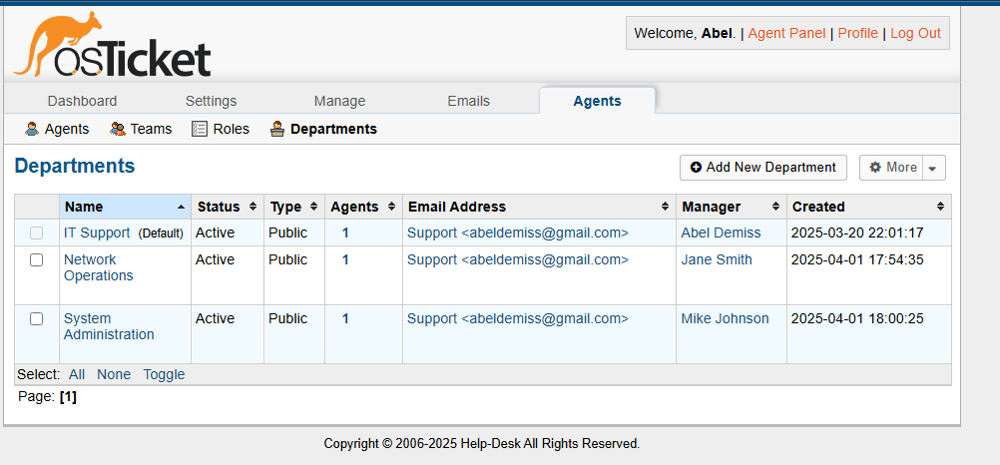
    *   **Staff & Roles:** Defined staff accounts and roles (Level 1, Level 2, Administrator) with specific permissions. Created support teams.
        *   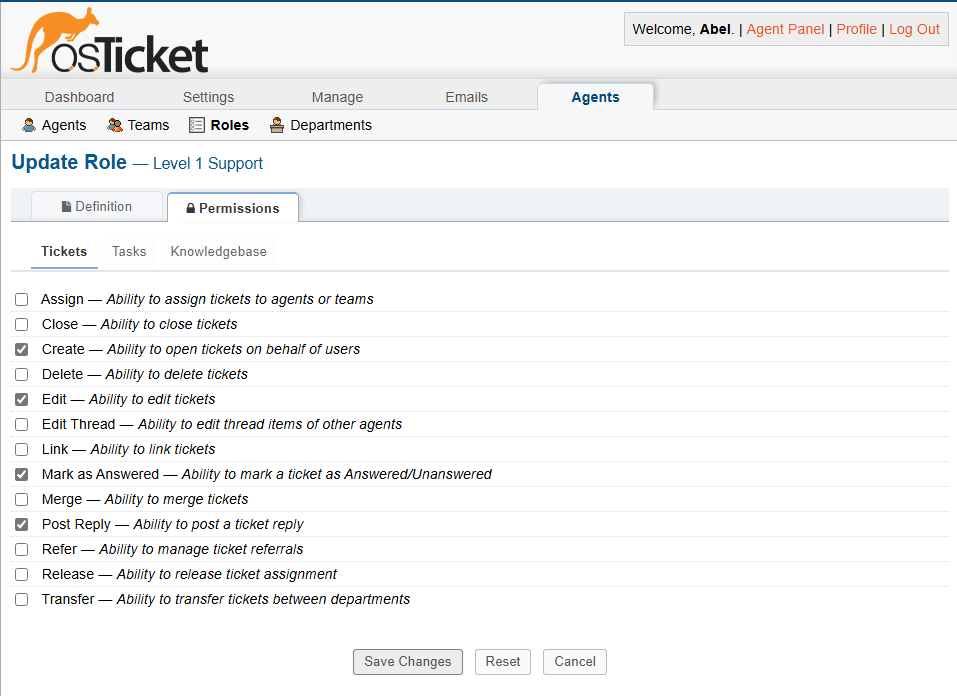
    *   **Help Topics:** Configured relevant help topics (e.g., `Password Reset`, `Network Connectivity`) linked to appropriate departments and priorities.
        *   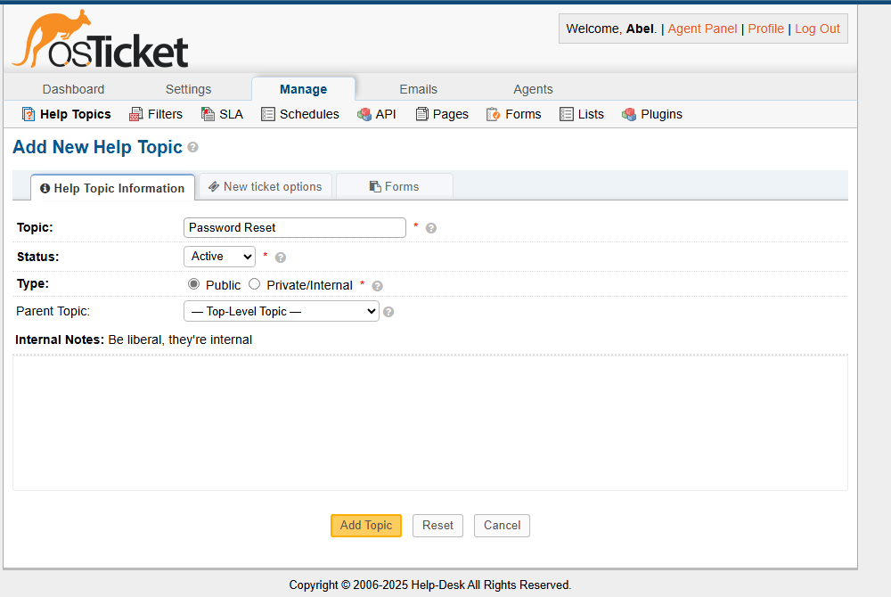
    *   **SLAs:** Defined Service Level Agreement plans (Urgent, High, Normal, Low) based on business hours and grace periods.
        *   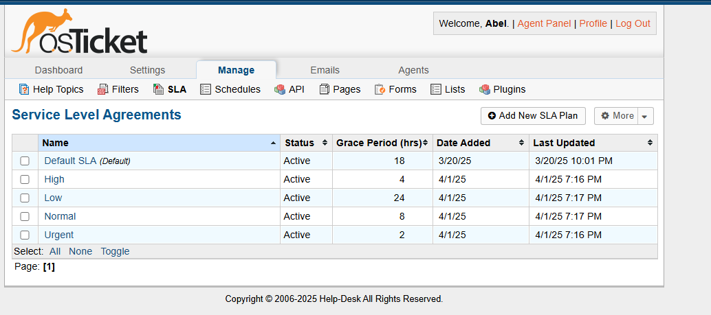
    *   **User Auth:** Configured basic user settings (Note: While AD integration is possible via plugins, this setup focuses on core osTicket configuration).
    *   See: [`Ticketing-System/Configuration.md`](Ticketing-System/Configuration.md)
*   **Ticket Lifecycle Demonstration:** Sample tickets illustrate the flow from user submission (via web portal) through agent assignment, troubleshooting (including interaction with AD for a password reset), internal notes, user communication, and resolution.
    *   See: [`Ticketing-System/Sample-Tickets.md`](Ticketing-System/Sample-Tickets.md)
    *   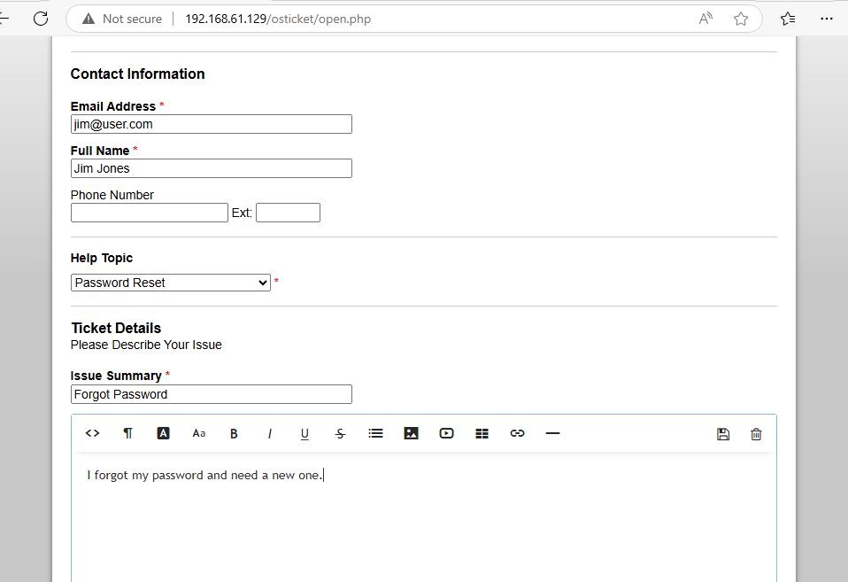
    *   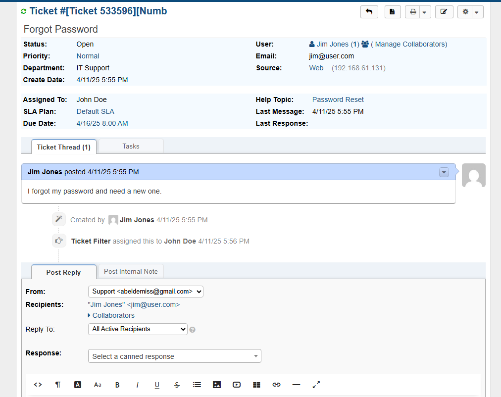
    *   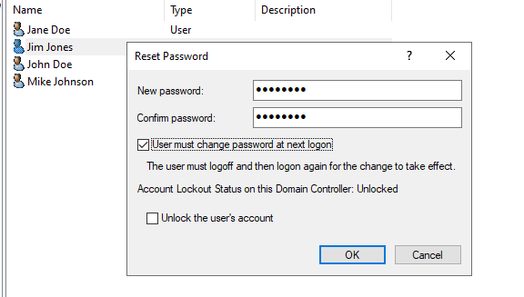
    *   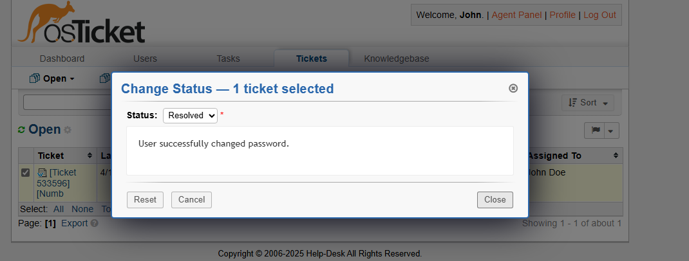

## Key Skills Demonstrated

*   **Virtualization:** VMware Workstation configuration and VM management.
*   **Windows Server Administration:** Installation, configuration (networking, roles), and management of Windows Server 2022.
*   **Active Directory:**
    *   Installation and configuration of AD Domain Services.
    *   Domain Controller promotion and forest setup.
    *   User, Group, and OU management (ADUC).
    *   Joining clients to a domain.
    *   Basic Group Policy understanding (implied through standard setup).
    *   DNS configuration for AD environments.
    *   NTFS and Share permission configuration.
*   **Web Server Management:** IIS installation, configuration, and hosting of PHP applications.
*   **Database Management:** MySQL installation, database/user creation, and basic SQL commands (via Workbench).
*   **PHP Configuration:** Setting up PHP environment and enabling necessary extensions for web applications.
*   **Ticketing System Implementation:** osTicket installation, configuration (departments, roles, SLAs, help topics), and administration.
*   **IT Support Processes:** Understanding of ticket lifecycle, escalation, and IT service management (ITSM) concepts through osTicket configuration.
*   **Troubleshooting:** Diagnosing common setup issues related to networking, permissions, and application prerequisites.

## How to Explore

1.  **Lab Setup:** Start with [`Lab-Setup/Virtualization.md`](Lab-Setup/Virtualization.md), then review the VM setup guides (`WindowsServer-VM.md`, `Windows10-VM.md`).
2.  **Active Directory:** Dive into [`Lab-Setup/Active-Directory.md`](Lab-Setup/Active-Directory.md) for the detailed AD configuration steps.
3.  **Ticketing System Installation:** Follow the prerequisites and osTicket setup in [`Ticketing-System/Installation.md`](Ticketing-System/Installation.md).
4.  **Ticketing System Configuration:** Understand the help desk structure in [`Ticketing-System/Configuration.md`](Ticketing-System/Configuration.md).
5.  **Workflow:** See the system in action with [`Ticketing-System/Sample-Tickets.md`](Ticketing-System/Sample-Tickets.md).

Screenshots illustrating key steps are embedded within each markdown file and stored in the corresponding `Screenshots/` subdirectories within `Lab-Setup/` and `Ticketing-System/`.
