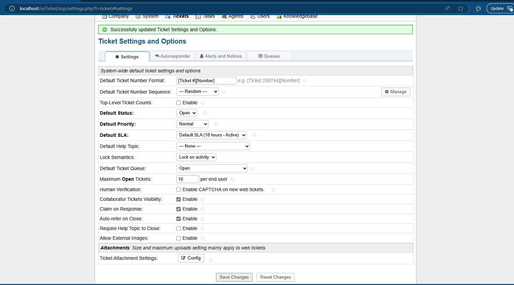
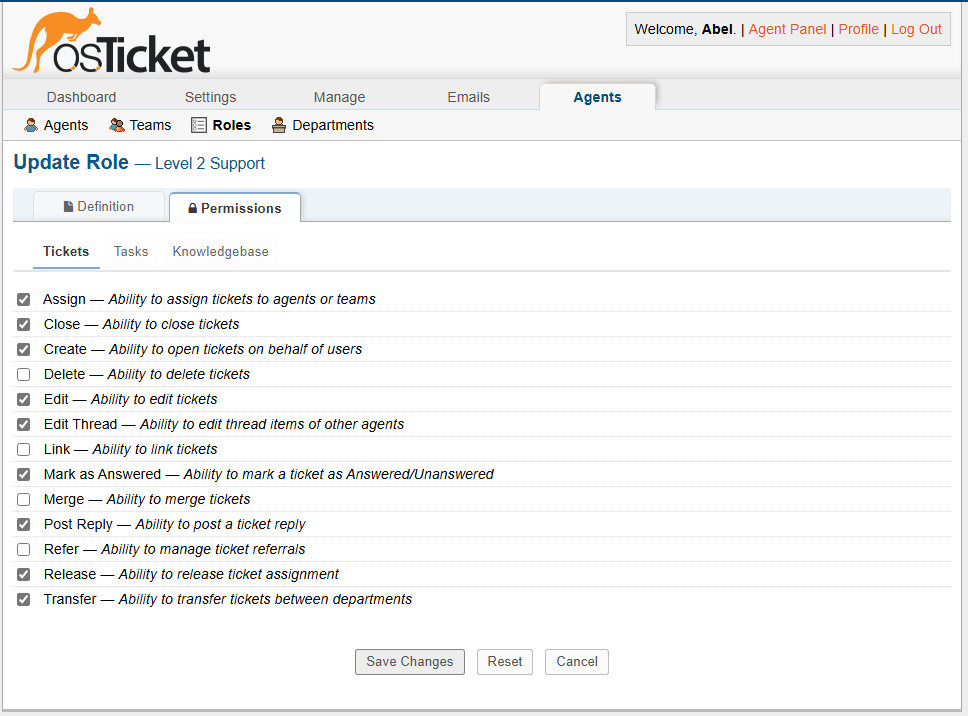
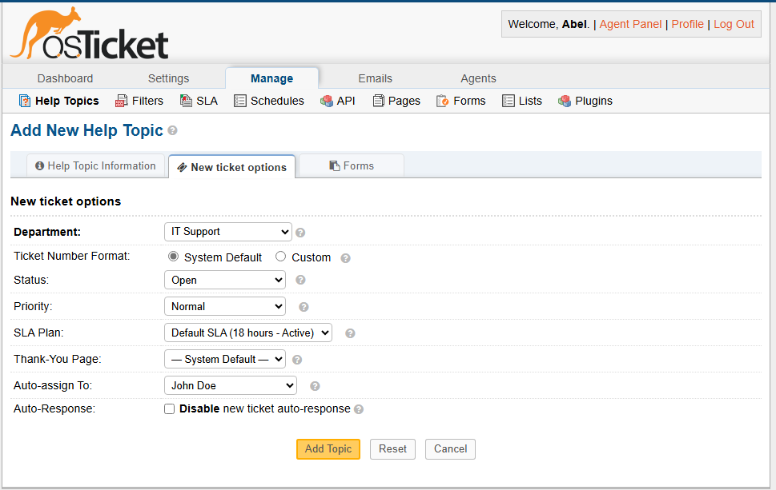

# osTicket Configuration Guide

This guide documents the configuration of osTicket for a professional help desk environment integrated with Active Directory. The configuration demonstrates IT service management best practices while creating a streamlined support workflow.

## Table of Contents
1. [Initial Admin Setup](#initial-admin-setup)
2. [Department Configuration](#department-configuration)
3. [Staff & Team Management](#staff--team-management)
4. [User Directory & Authentication](#user-directory--authentication)
5. [Help Topics & Ticket Categories](#help-topics--ticket-categories)
6. [SLA Plans & Service Management](#sla-plans--service-management)
7. [Workflow Automation](#workflow-automation)

## Initial Admin Setup

### Basic System Settings

1. Access the Admin Panel:
   - Navigate to http://localhost/osTicket/scp
   - Log in with administrator credentials

2. Configure System Settings:
   - Navigate to Admin Panel → Settings → System
   - Set Help Desk Name: `IT Help Desk`
   - Set Default Department: `Support`

3. Configure Ticket Settings:
   - Navigate to Admin Panel → Settings → Tickets
   - Set ticket number format: `[Ticket #][Number]` (under "Ticket Number Format")
   - Set the default ticket status to `Open` (under "Default Status")
   - Configure autoresponder settings (enable/disable as preferred)
   - Set Maximum Open Tickets per user (recommended: 10)


> Screenshot: Core system settings in osTicket admin panel

## Department Configuration

### Create Support Departments

> **Important Note**: Before assigning department managers, you must first create their staff accounts in osTicket.

1. Create IT Support Department:
   - Navigate to Admin Panel → Agents → Departments
   - Click `Add New Department`
   - Enter Name: `IT Support`
   - Email: `youremail+itsupport@gmail.com` (Replace with your email)
   - Set Department Manager: Your admin account
   - Staff Members: John Doe (Level 1 Support, youremail+itsupport@gmail.com)
   - Define SLA: `Default SLA`
   - Click `Create Dept`

2. Create Additional Departments:
   ```
   Department: Network Operations
   Email: youremail+netops@gmail.com (Replace with your email)
   Manager: Jane Smith
   
   Department: System Administration
   Email: youremail+sysadmin@gmail.com (Replace with your email)
   Manager: Mike Johnson
   ```

3. Configure Department Access:
   - Assign appropriate staff to each department
   - Set up department email templates and signatures
   - Configure auto-response messages

> **Note**: The email configuration uses plus (+) addressing, which allows all department emails to be routed to your main email inbox while maintaining separate department identities. For example, if your email is example@gmail.com, use example+itsupport@gmail.com for IT Support department.


> Screenshot: Department structure showing IT support hierarchy

## Staff & Team Management

### Create Staff Roles

1. Create Support Tiers:
   - Navigate to Admin Panel → Agents → Roles
   - Create the following roles:
     ```
     Role: Level 1 Support
     Permissions:
     - Create (can open tickets for users)
     - Edit (can edit tickets)
     - Post Reply (can respond to tickets)
     - Mark as Answered
     
     Role: Level 2 Support
     Permissions:
     - All Level 1 permissions +
     - Assign (can assign tickets to agents/teams)
     - Transfer (can move tickets between departments)
     - Close (can close tickets)
     - Edit Thread (can edit other agents' responses)
     - Release (can release ticket assignments)
     
     Role: Administrator
     Permissions:
     - All Level 2 permissions +
     - Delete (can delete tickets)
     - Merge (can combine related tickets)
     - Link (can link related tickets)
     - Refer (can manage ticket referrals)
     ```

2. Assign Roles to Staff:
   - Navigate to Admin Panel → Agents → Directory
   - Assign roles to existing staff:
     ```
     Your Admin Account: Administrator Role (use your personal account)
     Jane Smith: Level 2 Support Role
     Mike Johnson: Level 2 Support Role
     John Doe: Level 1 Support Role
     ```

3. Create Support Teams:
   - Navigate to Admin Panel → Agents → Teams
   - Create teams and assign staff:
     ```
     Team: Level 1 Support Team
     Members: John Doe, [Your Name]
     
     Team: Level 2 Support Team
     Members: [Your Name], Jane Smith, Mike Johnson
     ```

> **Note**: For this demo environment, you'll be able to switch between different staff accounts to demonstrate various roles and permissions while all email notifications are routed to your inbox using plus addressing. Create John Doe's account with youremail+jdoe@gmail.com (replace with your email).



> Screenshot: Staff role configuration showing permissions

## User Directory & Authentication

### Configure User Settings

1. Configure User Settings:
   - Navigate to Admin Panel → Settings → User
   - Enable User Registration
   - Set Authentication Requirements
   - Configure Password Policy

## Help Topics & Ticket Categories

### Configure Help Topics

1. Create Common Help Topics:
   - Navigate to Admin Panel → Manage → Help Topics
   - Add the following topics:
     ```
     Topic: Password Reset
     Department: IT Support
     Priority: Normal
     SLA Plan: Default
     
     Topic: Network Connectivity Issues
     Department: Network Operations
     Priority: High
     SLA Plan: Urgent
     
     Topic: Software Installation Request
     Department: IT Support
     Priority: Low
     SLA Plan: Normal
     
     Topic: System Outage
     Department: System Administration
     Priority: Emergency
     SLA Plan: Emergency
     ```



> Screenshot: Help topics configuration showing priority assignment

## SLA Plans & Service Management

### Create Service Level Agreements

1. Configure SLA Plans:
   - Navigate to Admin Panel → Manage → SLA Plans
   - Create the following SLAs:
     ```
     Name: Urgent
     Grace Period: 2 hour
     Schedule: 24/7
     
     Name: High Priority
     Grace Period: 4 hours
     Schedule: 24/7
     
     Name: Normal
     Grace Period: 8 hours
     Schedule: Business Hours
     
     Name: Low
     Grace Period: 24 hours
     Schedule: Business Hours
     ```


> Screenshot: SLA configuration showing different response time requirements

---

This configuration establishes a professional help desk environment with streamlined workflows and proper escalation paths. The system is designed to efficiently manage and resolve IT support issues while maintaining service level agreements.

For detailed information about using the system, see [Sample-Tickets.md](/Ticketing-System/Sample-Tickets.md) for examples of common support scenarios and their resolutions.
