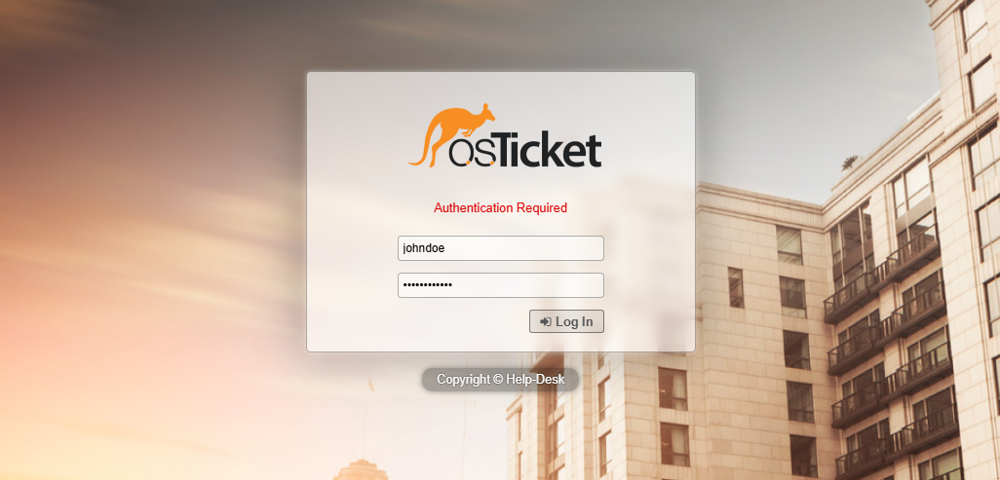
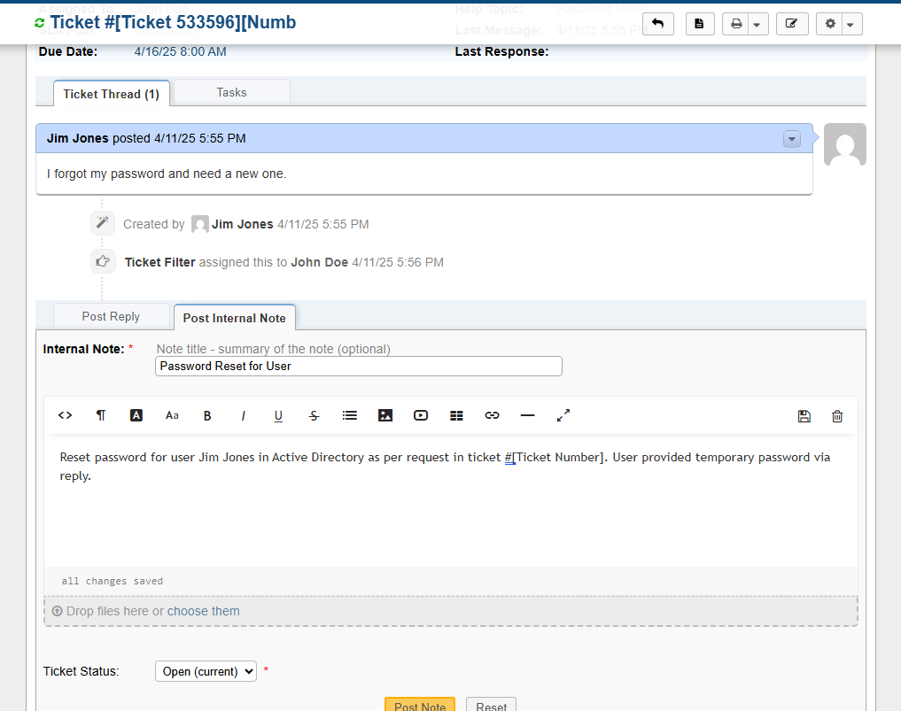

# osTicket - Ticket Lifecycle: Intake Through Resolution

This document outlines the lifecycle of sample tickets from intake to resolution within your osTicket help desk deployment.

## Environments and Technologies Used

*   **Virtualization:** VMware Workstation
*   **Web Server:** Internet Information Services (IIS) on Windows Server 2022
*   **Help Desk:** osTicket v1.18.2
*   **Database:** MySQL Workbench
*   **Client Access:** Web Browser on Windows 10 VM

## Operating Systems Used

*   **Server:** Windows Server 2022 VM
*   **Client:** Windows 10 Pro VM

> **Note**: To experience these ticket lifecycles from the end-user perspective, you should log into the **Windows 10 Pro VM** using one of the simulated employee accounts created in your Active Directory (e.g., 'Jim Jones', configured as described in the User Directory section of `Configuration.md` if AD was set up, or standard osTicket users otherwise). Access osTicket via the browser on this VM using the Server VM's IP address.

## Ticket Lifecycle Stages

This section will demonstrate common ticket scenarios following these general stages:

1.  **Intake:** How the ticket is created (e.g., user portal, email).
2.  **Assignment and Communication:** How the ticket is assigned to a department/agent and initial communication.
3.  **Working the Issue:** Steps taken by support staff to diagnose and address the problem.
4.  **Resolution:** The final fix and communication back to the user, followed by closing the ticket.

---

## Sample Ticket 1: Password Reset Request

*   **Scenario:** A user forgets their password and submits a ticket via the web portal.
*   **Intake:**
    *   User navigates to `http://<Server_VM_IP>/osTicket/`
    *   User selects the "Password Reset" Help Topic.
    *   User fills out the ticket form and submits.
    
*   **Assignment and Communication:**
    *   Ticket is automatically assigned to the "IT Support" department based on the Help Topic.
    *   Agent John Doe logs into the Staff Control Panel (SCP) at `http://localhost/osTicket/scp`.
    
    *   John Doe (Level 1 Support) sees the ticket in the queue.
    
*   **Working the Issue:**
    *   John Doe opens the ticket.
    *   John Doe resets the user's password in the Active Directory.
    
    *   John Doe adds an internal note about the action taken.
    
*   **Resolution:**
    *   John Doe posts a reply to the user with the temporary password and instructions.
    
    *   John Doe sets the ticket status to "Resolved".
    
    *   The user confirms they can log in.
    *   The ticket is eventually closed.

## Sample Ticket 2: Network Connectivity Issue

*   **Scenario:** A user reports being unable to access network resources.
*   **Intake:**
    *   User submits ticket via the portal, selecting "Network Connectivity Issues".
*   **Assignment and Communication:**
    *   Ticket automatically assigned to "Network Operations" department.
    *   Jane Smith (Level 2 Support) is assigned or claims the ticket.
    *   Jane communicates with the user to gather more details (e.g., specific error messages, what resources are inaccessible).
*   **Working the Issue:**
    *   Jane performs troubleshooting steps:
        *   Checks user's IP configuration.
        *   Pings relevant gateways/servers from the user's machine (if possible via remote tools) or instructs the user.
        *   Checks network switch status/port configuration.
        *   Investigates potential DNS issues.
    *   Jane documents findings in the ticket.
*   **Resolution:**
    *   Jane identifies the issue (e.g., incorrect DNS setting on the user's machine).
    *   Jane provides instructions or remotely corrects the setting.
    *   Jane confirms with the user that connectivity is restored.
    *   Jane sets the ticket status to "Resolved" and adds resolution details.
    *   Ticket is closed.
